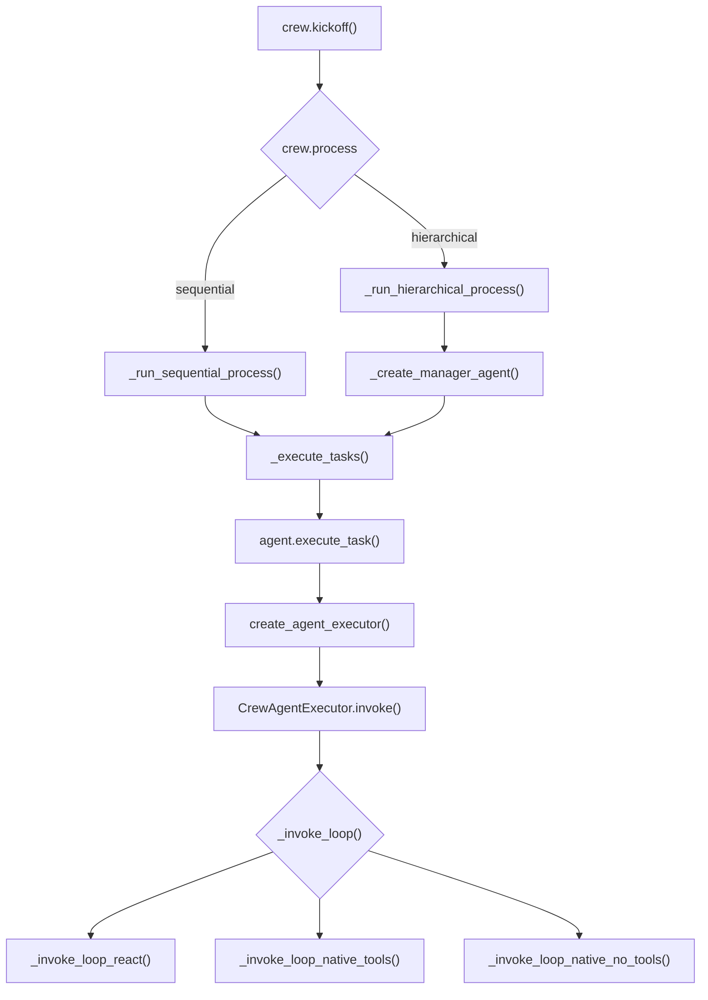

# CrewAI 源码地图（v1.15.21）

这份文档是 CrewAI 源码的「全局导航图」。目标不是讲透每个机制，而是让你读完能回答三个问题：CrewAI 由哪几层构成？一次 `kickoff` 从哪走到哪？想改某个能力该去哪个文件？

**适用对象**：有 AI Agent 基础概念（知道 agent / tool / task 大致是什么）的工程师，Python 能读、不要求能写。

**版本基线**：CrewAI **v1.15.21**，commit `a8d330de0`（2026-09-09）。仓库已经改成 monorepo，网上大量教程还停留在旧的单包结构，注意区分。

**范围**：只讲源码结构与阅读路径。每个机制的深入拆解（含渐进式复现）另开文档，不在这里展开。

## 1. 仓库结构：它已经是 monorepo 了

顶层是 `lib/`，下面六个独立包，各自有 `pyproject.toml`：

| 包 | 职责 |
|-|-|
| `lib/crewai` | 核心框架本体，本文件主要讲的就是它 |
| `lib/crewai-core` | 共享工具：版本、路径、user-data、telemetry、printer |
| `lib/crewai-tools` | 官方工具集（不在核心包内） |
| `lib/crewai-files` | 多模态输入的文件处理 |
| `lib/cli` | CLI：scaffold、run、deploy、manage |
| `lib/devtools` | 版本号 bump 与 git 自动化，非运行时 |

核心代码在 `lib/crewai/src/crewai/`，下面所有路径都相对它。

## 2. 一次 kickoff 的执行链路

读这条链路的三个要点：

1. **编排在 Crew，执行在 Agent，循环在 Executor**。三层各管一段，别混着读。
2. **hierarchical 会临时造一个 manager agent**，用它来做任务分配和汇总，等于把调度器也交给 LLM。这是它和 LangGraph 那种「代码图确定性编排」最大的分野。
3. **最底层不是一个循环，是三条**：文本 ReAct、原生 tool calling、原生但无工具。模型能力不同走不同路径。

## 3. 模块全景

按代码量排序，规模用 LOC 表示，能看出作者的投入重心在哪。

| 模块 | 规模 | 一句话职责 |
|-|-|-|
| `a2a/` | 13,955 LOC / 47 文件 | Agent-to-Agent 协议通信 |
| `flow/` | 13,138 LOC / 41 文件 | 事件驱动的确定性编排（含持久化、人在环、DSL、可视化） |
| `llms/` | 13,174 LOC / 25 文件 | 多 provider LLM 适配层（base_llm、hooks、providers、cache） |
| `utilities/` | 10,905 LOC / 52 文件 | 通用工具与异常体系 |
| `events/` | 10,518 LOC / 41 文件 | 事件总线，用于监控和扩展 agent 行为 |
| `experimental/` | 6,367 LOC / 21 文件 | 实验性与兼容导出（新执行器、会话式） |
| `rag/` | 6,028 LOC / 95 文件 | RAG 基础设施 |
| `agents/` | 5,393 LOC / 29 文件 | **真正的执行器**：推理循环、输出解析、工具处理 |
| `memory/` | 5,360 LOC / 14 文件 | 统一记忆：LLM 分析 + 可插拔存储 |
| `project/` | 4,315 LOC / 8 文件 | 项目级配置与脚手架支撑 |
| `tools/` | 3,701 LOC / 19 文件 | 工具基类、工具调用、失败处理、缓存 |
| `agent/` | 2,795 LOC / 6 文件 | **Agent 定义**：属性、校验、任务执行入口 |
| `llm.py` | 2,775 LOC | LLM 对外统一封装 |
| `mcp/` | 2,716 LOC / 11 文件 | MCP 客户端支持（client、config、transports、tool_resolver） |
| `crew.py` | 2,490 LOC | **编排核心**：Crew 类、校验、kickoff 主流程 |
| `hooks/` | 2,056 LOC / 8 文件 | LLM 与工具调用钩子（after_llm_call 等） |
| `state/` | 1,725 LOC / 10 文件 | checkpoint 配置与监听、事件记录、运行时状态 |
| `task.py` | 1,566 LOC | **任务定义**：输出契约、上下文、护栏 |
| `telemetry/` | 1,547 LOC / 4 文件 | 遥测 |
| `skills/` | 1,540 LOC / 9 文件 | Agent Skills 标准实现（loader、registry、parser、validation） |
| `knowledge/` | 1,472 LOC / 21 文件 | 知识源接入 |
| `types/` | 1,120 LOC / 6 文件 | 回调、crew_chat、streaming、usage_metrics |
| `lite_agent.py` | 1,068 LOC | 轻量 Agent 实现 |
| `crews/` | 607 LOC / 3 文件 | CrewOutput 等编排产物 |
| `core/` | 563 LOC / 4 文件 | 核心接口定义 |
| `tasks/` | 435 LOC / 6 文件 | 条件任务、输出格式、护栏 |
| `security/` | 274 LOC / 4 文件 | 指纹与安全配置 |
| `process.py` | 11 LOC | 只有 Process 枚举：sequential / hierarchical |

## 4. 关键模块拆解

### 4.1 编排层：crew.py + task.py + process.py

`process.py` 只有 11 行，是个枚举。但它的取值决定整条链路走向，是理解 CrewAI 的第一把钥匙。

`crew.py` 里 `Crew(FlowTrackable, BaseModel)` 承担了全部编排职责：

- `kickoff()`：对外唯一主入口（约 995 行起）
- `_run_sequential_process()`：顺序执行（约 1512 行起）
- `_run_hierarchical_process()`：分层执行（约 1516 行起）
- `_create_manager_agent()`：造 manager agent（约 1521 行起）
- `_execute_tasks()`：真正串任务的循环（约 1561 行起）

校验逻辑占了很大篇幅：`validate_tasks`、`validate_first_task`、`validate_context_no_future_tasks`、`validate_async_tasks_not_async` 等。这些校验告诉你「哪些组合是合法配置」，比读文档更快建立边界感。

`task.py` 1,566 行，Task 是一等公民：描述、期望输出、上下文依赖、`output_pydantic` 输出契约。`tasks/` 目录补充了 `conditional_task.py`（条件任务）和两个护栏（`hallucination_guardrail.py`、`llm_guardrail.py`）——让 LLM 自我校验输出是否为幻觉，这个思路可以直接迁移到自己的项目。

### 4.2 Agent 层：agent/ 与 agents/ 的分工

这两个目录名字很像，职责完全不同，是最容易读混的地方：

| 目录 | 是什么 |
|-|-|
| `agent/` | **定义**。核心是 `agent/core.py` 里的 `Agent(BaseAgent)`，管属性、校验、记忆检索、任务前置准备 |
| `agents/` | **执行**。核心是 `agents/crew_agent_executor.py`，管推理循环、输出解析、工具调用 |

Agent 侧的关键方法：`execute_task()`（约 856 行）是任务执行入口，`_build_execution_prompt()`（约 1114 行）拼 prompt，`create_agent_executor()`（约 1157 行）造出执行器，然后交给 `_execute_with_timeout()` 或 `_execute_without_timeout()`。

执行器侧的循环分发是这样切的：`invoke()`（约 230 行）→ `_invoke_loop()`（约 331 行）按能力分发到三条路径：

- `_invoke_loop_react()`（约 352 行）：文本 ReAct，靠解析文本拿 action
- `_invoke_loop_native_tools()`（约 506 行）：原生 tool calling，模型直接返回结构化 tool_calls
- `_invoke_loop_native_no_tools()`（约 619 行）：原生接口但没有工具

再往下 `_handle_native_tool_calls()`（约 689 行）和 `_handle_agent_action()`（约 1455 行）负责把工具结果回填进对话。`agents/` 里还有 `parser.py`（解析 LLM 输出）、`tools_handler.py`（工具处理）、`step_executor.py`（单步执行）——这就是 agent 主循环的黄金三件套。

### 4.3 Flow：从玩具到生产的那一半

`flow/` 是全仓最重的业务模块（13,138 LOC），入口是 `flow/flow.py` 的 `Flow(_ConversationalMixin, RuntimeFlow[T])`。它和 Crew 是互补关系：

- **Crew**：自主探索，角色扮演，LLM 决定下一步
- **Flow**：确定性流程，事件驱动，代码决定下一步

`flow/` 里的子目录值得单独看：`persistence/`（持久化与续跑）、`runtime/`（运行时）、`dsl/`（声明式定义）、`visualization/`（可视化）、`human_feedback.py`（人在环）、`conversational.py`（会话式）。**想学「agent 怎么变成生产系统」，这一块比 crew.py 更值。**

### 4.4 LLM 层：llms/ 与 llm.py

`llms/` 13,174 LOC，是典型的适配器模式：`base_llm.py` 定接口，`providers/` 做各家实现，`hooks/` 挂调用钩子，`cache.py` 管缓存，`_finish_reason_utils.py` 统一各家不一致的结束原因。`llm.py` 是对外统一封装。

看一个多 provider 框架怎么把「参数各异、返回各异」的模型收敛成一套接口，这个目录是最好的样本。

### 4.5 Memory：统一记忆

`memory/` 的包说明写得很直白：统一 Memory，带 LLM 分析和可插拔存储。核心文件是 `unified_memory.py`，配套 `analyze.py`（分析）、`recall_flow.py`（召回流）、`encoding_flow.py`（编码流）、`memory_scope.py`（作用域）、`storage/`（存储后端）。

### 4.6 Tools 与外部能力

- `tools/`：`base_tool.py` 基类、`structured_tool.py`、`tool_calling.py`、`tool_failure.py`（失败处理）、`cache_tools/`、`memory_tools.py`，还有 MCP 相关的 `mcp_tool_wrapper.py` 和 `mcp_native_tool.py`
- `mcp/`：MCP 客户端，含 `client.py`、`config.py`、`transports/`、`tool_resolver.py`
- `a2a/`：Agent-to-Agent 协议，全仓最大的子模块（13,955 LOC），有 `auth/`、`config.py`、`wrapper.py`、`task_helpers.py`
- `skills/`：Agent Skills 标准的完整实现（loader / registry / parser / validation）
- `knowledge/` + `rag/`：知识源与检索基础设施

### 4.7 可观测性：events + state + hooks + telemetry

四者分工：`events/`（10,518 LOC）是事件总线；`hooks/` 提供 LLM 调用与工具调用的钩子点；`state/` 管 checkpoint 配置、checkpoint 监听、事件记录与运行时状态；`telemetry/` 管遥测上报。

如果要在生产里做「过程可观测 + 可恢复」，这四个目录的拆分方式值得直接抄。

## 5. 推荐阅读顺序

别从头顺着读。分三阶段，每阶段有明确的完成标准。

### 5.1 阶段一：建立主干（目标：能画出调用链）

1. 读 `process.py`（11 行），记住两个取值
2. 读 `crew.py` 的 `kickoff` 与 `_execute_tasks`，只看主流程，跳过校验
3. 读 `agent/core.py` 的 `execute_task`，看它怎么把任务交给执行器
4. 读 `agents/crew_agent_executor.py` 的 `invoke` 与 `_invoke_loop`，看三条循环怎么分

**完成标准**：能不看文档画出第 2 节那张图。

### 5.2 阶段二：选一条机制深挖（目标：能讲清一个机制的边界）

二选一：

- 想学**多 agent 怎么协同** → `_run_hierarchical_process` + `_create_manager_agent` + manager 的工具集（`get_delegation_tools`）
- 想学**agent 怎么进生产** → `flow/persistence/` + `state/checkpoint_*` + `flow/human_feedback.py`

**完成标准**：能说出这个机制在什么情况下会失效、有哪些已知取舍。

### 5.3 阶段三：横向对照（目标：形成判断）

把它和你看过的其他框架对照：Crew 的 Crew ≈ KaibanJS 的看板；Flow ≈ Mastra 的 workflow；hierarchical 的 manager ≈ OpenAI Agents SDK 的 handoff。同一个问题，不同框架给的答案不同，差异点就是设计取舍所在。

## 6. 关键 seam 速查表

行号基于 v1.15.21，版本升级后可能漂移，用类名和方法名搜索定位更稳。

| 文件 | 行号 | 是什么 |
|-|-|-|
| `process.py` | 4 | Process 枚举 |
| `crew.py` | 164 | class Crew |
| `crew.py` | 995 | kickoff() |
| `crew.py` | 1512 | _run_sequential_process() |
| `crew.py` | 1516 | _run_hierarchical_process() |
| `crew.py` | 1521 | _create_manager_agent() |
| `crew.py` | 1561 | _execute_tasks() |
| `agent/core.py` | 216 | class Agent(BaseAgent) |
| `agent/core.py` | 856 | execute_task() |
| `agent/core.py` | 1157 | create_agent_executor() |
| `agents/crew_agent_executor.py` | 98 | class CrewAgentExecutor |
| `agents/crew_agent_executor.py` | 230 | invoke() |
| `agents/crew_agent_executor.py` | 331 | _invoke_loop() 分发 |
| `agents/crew_agent_executor.py` | 352 / 506 / 619 | 三条循环实现 |
| `agents/crew_agent_executor.py` | 689 | _handle_native_tool_calls() |
| `flow/flow.py` | 33 | class Flow |

## 7. 哪些地方值得学，哪些要小心

### 值得学

- **用枚举做架构开关**：11 行的 Process 决定两条完全不同的执行路线，抽象成本极低
- **定义与执行分离**：`agent/` 管定义、`agents/` 管执行，职责边界干净
- **三条循环兜底**：不假设模型一定有原生 tool calling 能力，回退路径是显式写出来的
- **输出护栏**：用 LLM 校验 LLM 的输出是否为幻觉，这个模式可直接复用到自己的项目
- **Flow 与 Crew 互补**：自主探索和确定性流程并存，而不是二选一，这是它走向生产的关键判断

### 要小心

- **上帝类**：`crew.py` 2,490 行、`task.py` 1,566 行，都在单文件里承载了过多职责，是「易用性换可维护性」的典型妥协。别通读，按方法切入。
- **目录命名易混**：`agent/` 和 `agents/`、`tasks/` 和 `task.py`、`crews/` 和 `crew.py`，读之前先确认自己打开的是哪个
- **文档滞后于代码**：monorepo 改造后大量教程仍按旧结构写，以磁盘代码为准
- **行号会漂移**：本文行号对应 v1.15.21，后续版本请用符号名搜索

## 8. 精读知识域清单（源码地图 → 逐块拆解）

这份地图是**总纲**。按它逐块精读，**一次只拆一块**。每块产出 = 分析文档（`docs/`）+ 可运行复现代码（`articles/`）+ 任务书（`tasks/`），完成后回这里把状态从 ⬜ 改成 ✅。

### 工作循环

1. 分析方（家里 Mac）按地图选一块 → 写任务书到 `tasks/<块名>/`
2. 志武 pull → 让公司电脑的 Codex 按任务书实现 → push
3. 分析方 pull → 审代码与报告 → 写分析文档 `docs/` → 出下一块任务书

### 精读一：hierarchical 多 agent 协同 🔄 进行中

- **源码**：`crew.py`（2490 行，编排）、`agent/core.py`（Agent 定义）、`agents/crew_agent_executor.py`（执行循环）、`tools/agent_tools/`（同事即工具）、`process.py`
- **核心机制**：process 只是开关（两条分支进同一个 `_execute_tasks`）；hierarchical 下原始 Task 由 manager 执行、coworker 跑现场新建的临时 Task；manager 被禁止带普通工具；`AgentTools` 把同事包装成工具（delegate + ask question）；名字消毒兜住弱模型的非法 JSON；错误回文本不抛异常
- **学习价值**：LLM 编排 vs 代码图编排的分歧点；多 agent 协同可以完全复用工具调用循环
- **任务书**：`tasks/crewai-hierarchical/`（9 步，含前置底盘 step-01~04）
- **状态**：🔄 任务书已出，等 Codex 实现

### 精读二：Flow 事件驱动编排 ⬜

- **源码**：`flow/`（13138 LOC）：`flow.py`、`persistence/`、`runtime/`、`dsl/`、`visualization/`、`human_feedback.py`、`conversational.py`
- **核心机制**：确定性流程与 Crew 的自主循环互补；持久化续跑；人在环；声明式 DSL
- **学习价值**：agent 怎么从玩具变成生产系统——比 `crew.py` 更值钱

### 精读三：记忆管理 ⬜

- **源码**：`memory/`（5360 LOC）：`unified_memory.py`、`analyze.py`、`recall_flow.py`、`encoding_flow.py`、`memory_scope.py`、`storage/`
- **核心机制**：统一 Memory + LLM 分析 + 可插拔存储；作用域切分

### 精读四：LLM 适配层 ⬜

- **源码**：`llms/`（13174 LOC）+ `llm.py`（2775 行）：`base_llm.py`、`providers/`、`hooks/`、`cache.py`、`_finish_reason_utils.py`
- **核心机制**：适配器模式把参数各异、返回各异的模型收敛成一套接口；结束原因归一化

### 精读五：事件总线与可观测性 ⬜

- **源码**：`events/`（10518 LOC）、`hooks/`、`state/`、`telemetry/`
- **核心机制**：事件总线解耦；LLM/工具调用钩子点；checkpoint 与运行时状态

### 精读六：外部能力接入 ⬜

- **源码**：`mcp/`（MCP 客户端）、`a2a/`（13955 LOC，全仓最大）、`skills/`、`rag/`、`knowledge/`、`tools/`
- **核心机制**：外部能力如何做成可插拔模块；Agent Skills 标准实现

### 精读七：Task 输出契约与护栏 ⬜

- **源码**：`task.py`（1566 行）、`tasks/`：`conditional_task.py`、`output_format.py`、`task_output.py`、`hallucination_guardrail.py`、`llm_guardrail.py`
- **核心机制**：输出契约（`output_pydantic`）；条件任务；用 LLM 校验 LLM 的输出是否为幻觉

### 精读八：kickoff 生命周期与 checkpoint ⬜

- **源码**：`crew.py:995-1088`、`state/checkpoint_config.py`、`state/checkpoint_listener.py`、`state/runtime.py`
- **核心机制**：一个入口承担输入插值、checkpoint 恢复、streaming、事件作用域、前后回调、memory drain、用量统计

---

### 精读一详情：9 步拆解

- **前置底盘（step-01~04）**：Process 开关与共享执行循环 → Task 数据流 → Agent/Executor 分离 → 工具调用循环
- **hierarchical 本体（step-05~09）**：Manager 创建与任务归属 → AgentTools 同事即工具 → 委派闭环 → 错误与边界 → 生命周期

每步内置**对照组**（朴素做法 vs CrewAI 做法并排跑），用来看清设计取舍。

产出目标：

- `docs/crewai-hierarchical-analysis.md`
- `articles/crewai-hierarchical-python/`、`articles/crewai-hierarchical-ts/`
- `reports/crewai-hierarchical-*.md`
- 飞书文档（AI Agent 知识点手册 / crewai源码分析）
